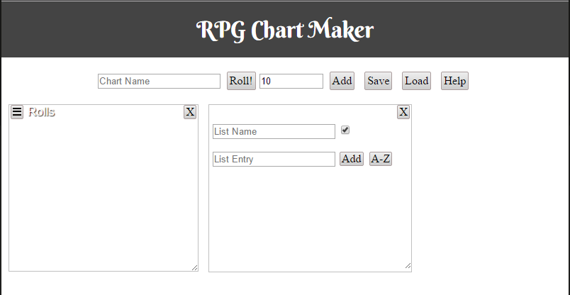

# rpgchartmaker

You can see a working version of the app at [https://rpg.medicationforall.com/rpgchartmaker/](https://rpg.medicationforall.com/rpgchartmaker/)

This is an application for rapidly creating Charts for Role Playing Games. 
Can create Lists, Object Lists, and Roll Tables. 
For all practical purposes it is a means for modeling string arrays and object arrays in JSON.

## Requirements
http web server. Apache, python, or IIS will work fine.

### Python quick webserver
Requires python to be installed.
1. Open a command prompt in the directory where you have rpgchartmaker downloaded.
2. In the command prompt type the following:
        python -m http.server
3. Open a web browser and in the address bar go to **http://localhost:8000**

## PHP Servlet
**Optional**: I wrote a servlet to enable storing and sharing charts from a server.
The servlet is written in PHP uses MYSQL for the database. By default the servlet is turned off. Perform the following to enable:

1. Modify config.json to change the share settings for the client.
2. In chartStore.php modify the database connection
        $mysqli = new mysqli('localhost','[db username]','[db password]','rpgChartStore');

3. Install the MYSQL database by running [mysql/rpgChartStore.sql](mysql/rpgChartStore.sql)

## Libraries
This Application uses:
* [jQuery](https://jquery.com/)
* [jQuery-ui](http://jqueryui.com/)
* [jQuery UI Touch Punch](http://touchpunch.furf.com/)
* [FileSaver.js](https://github.com/eligrey/FileSaver.js/)
* [Animate.css](https://daneden.github.io/animate.css/)
* [seedrandom.js](https://github.com/davidbau/seedrandom)
* [tablesorter](https://github.com/Mottie/tablesorter)
* [Game-icons.net](http://game-icons.net/)
* [Berkshire Swash](https://fonts.google.com/specimen/Berkshire+Swash)

All of the scripts are being called via cdn. 
If you want to run this application offline you'll need to locally reference those libraries.

## License
This application is Licensed under LGPL see the license directory.
